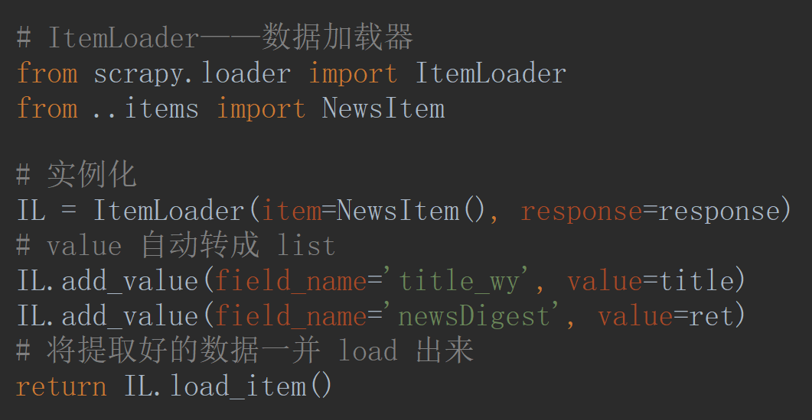
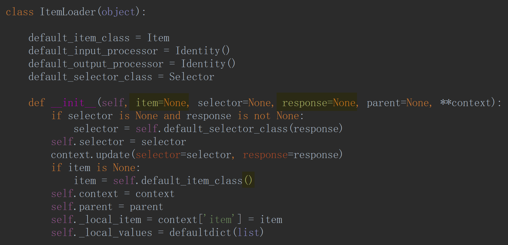
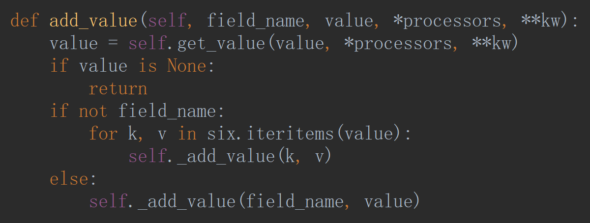
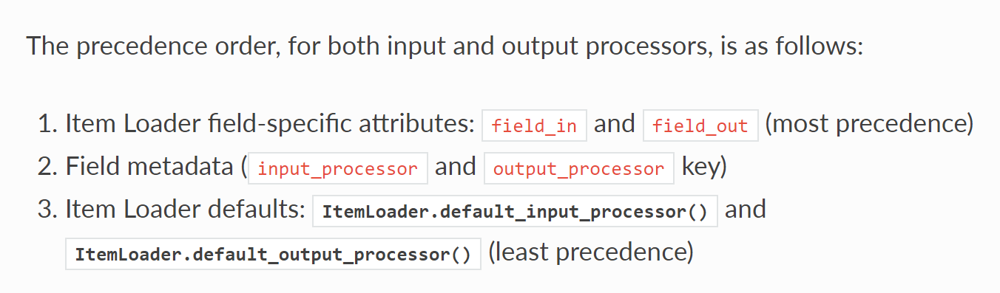
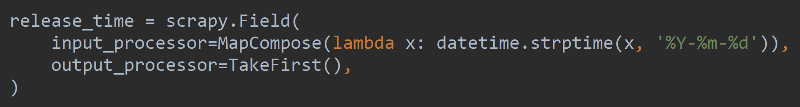

# ItemLoader

- <strong>spiders</strong>

- `ItemLoader`

- `add_value()`

- `item._values`——值

- <strong>Item</strong>

- `input_processor=MapCompose()`——预处理，可调用多个函数

- 切换成 datatime

- `output_processor=TakeFirst()`——[0]

