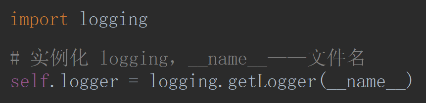
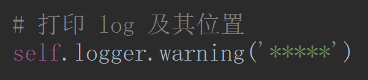

# Logging

- settings

```python
# 只输出比 error 等级大的，日志信息
LOG_LEVEL='ERROR'

# log 存放路径
LOG_FILE='【路径】'
```

- piplines





```python
import logging

# 实例化 __name__——文件名
logger = logging.getLogger(__name__)
logger.warning
```


