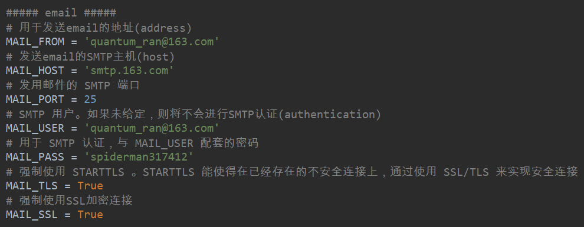
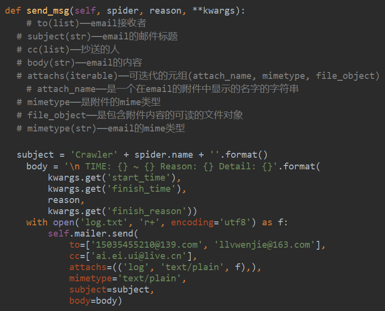

# MailSender

- <strong>settings</strong>



```python
##### email #####
# 用于发送email的地址(address)
MAIL_FROM = 'quantum_ran@163.com'
# 发送email的SMTP主机(host)
MAIL_HOST = 'smtp.163.com'
# 发用邮件的 SMTP 端口
MAIL_PORT = 25
# SMTP 用户。如果未给定，则将不会进行SMTP认证(authentication)
MAIL_USER = 'quantum_ran@163.com'
# 用于 SMTP 认证，与 MAIL_USER 配套的密码
MAIL_PASS = 'spiderman317412'
# 强制使用 STARTTLS 。STARTTLS 能使得在已经存在的不安全连接上，通过使用 SSL/TLS 来实现安全连接
MAIL_TLS = True
# 强制使用SSL加密连接
MAIL_SSL = True
```



```python
def send_msg(self, spider, reason, **kwargs):
    subject = 'Crawler' + spider.name + ''.format()
    body = '\n TIME: {} ~ {} Reason: {} Detail: {}'.format(
        kwargs.get('start_time'),
        kwargs.get('finish_time'),
        reason,
        kwargs.get('finish_reason'))
    with open('log.txt', 'r+', encoding='utf8') as f:
        self.mailer.send(
            to=['15035455210@139.com', 'llvwenjie@163.com'],
            cc=['ai.ei.ui@live.cn'],
            attachs=(('log', 'text/plain', f),),
            mimetype='text/plain',
            subject=subject,
            body=body)
```

