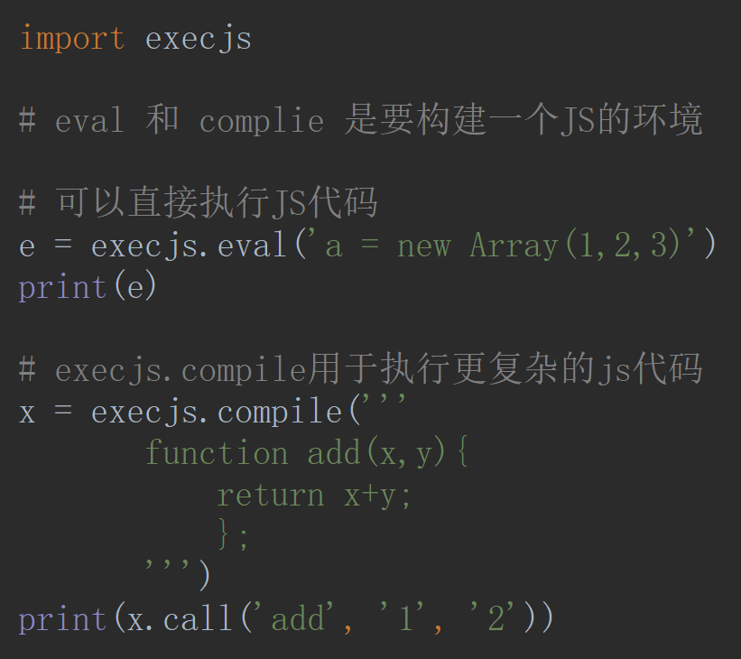
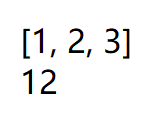

# PyExecJS

`pip install PyExecJS`

要有 Node.js

```python
import execjs

# eval 和 complie 是要构建一个JS的环境

# 可以直接执行JS代码
e = execjs.eval('a = new Array(1,2,3)')
print(e)

# execjs.compile用于执行更复杂的js代码
x = execjs.compile('''
       function add(x,y){
           return x+y;
           };
       ''')
print(x.call('add', '1', '2'))
```





