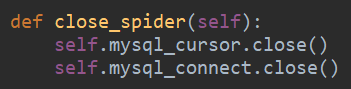
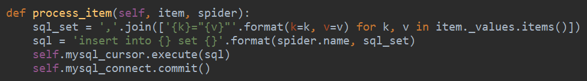

# 与 python 的交互

1. 建立连接

```python
# Connect to the database
connection = pymysql.connect(
    host='localhost',
    user='user',
    password='passwd',
    db='db',
    charset='utf8mb4',                             		cursorclass=pymysql.cursors.DictCursor
)
```

2. 建立游标

```python
connection.cursor()
```

3. 提交数据

```python
connection.commit()
```

4. 关闭连接

```python
connection.close()
```



- `pymysql.escape_string()`—— 转义字符串

# 可变 items 增加



```python
def process_item(self, item, spider):
    sql_set = ','.join(['{k}="{v}"'.format(k=k, v=v) for k, v in item._values.items()])
    sql = 'insert into {} set {}'.format(spider.name, sql_set)
    self.mysql_cursor.execute(sql)
    self.mysql_connect.commit()
```

