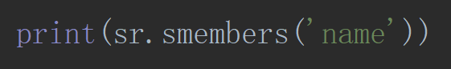

# 与python交互

1. 连接

```python
from redis import StrictRedis

sr = StrictRedis(host='localhost', port=6379, db=0)
```


## 增

- `.sadd(self, name, *values)`——给 name 对应的集合中添加元素


## 查

- `.scard(self, name)`——获取 name 对应的集合中的元素个数


- `.smembers(self, name)`——获取 name 对应的集合的所有成员




- `.sdiff(self, keys, *args)`——在第一个 name 对应的集合中且不在其他 name 对应的集合的元素集合


- `.sismember(self, name, value)`——检查 value 是否是 name 对应的集合内的元素


- `.exists(self, name)`——检查 redis 的 name 是否存在

- `.keys(self, pattern='*')`——根据`*?`等通配符匹配获取 redis 的 name

- `.randomkey(self)`——随机获取一个 redis 的 name（不删除）

- `.type(self, name)`——获取 name 对应值的类型

## 改

- `.smove(self, src, dst, value)`——将某个元素从一个集合中移动到另外一个集合


- `.rename(self, src, dst)`——重命名

- `.move(self, name, db))`——将 redis 的某个 name 移动到指定的 db 下

- 

## 删

- `.spop(self, name)`——从集合的右侧移除一个元素，并将其返回


- `.flushdb(self,asynchronous=False)`——清空当前 db 中的数据,默认是同步。若开启异步 asynchronous=True ，会新起一个线程进行清空操作，不阻塞主线程

- `.flushall(self,asynchronous=False)`——清空所有 db 中的数据，默认是同步。异步同flushdb

- `.delete(self, *names)`——根据 name 删除 redis 中的任意数据类型

