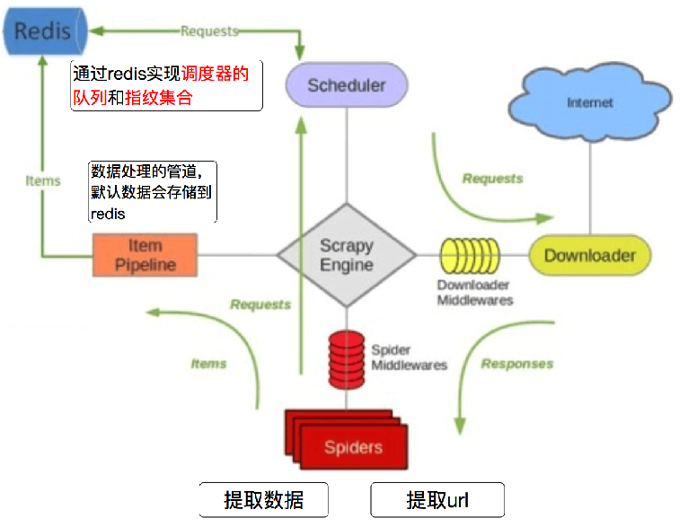
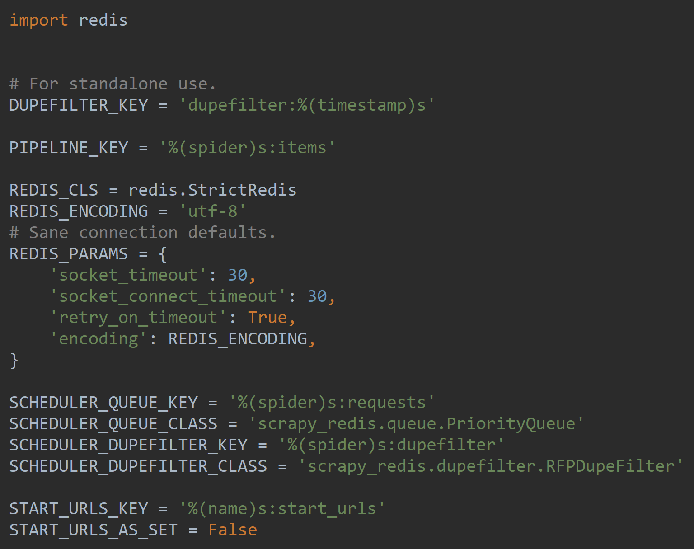
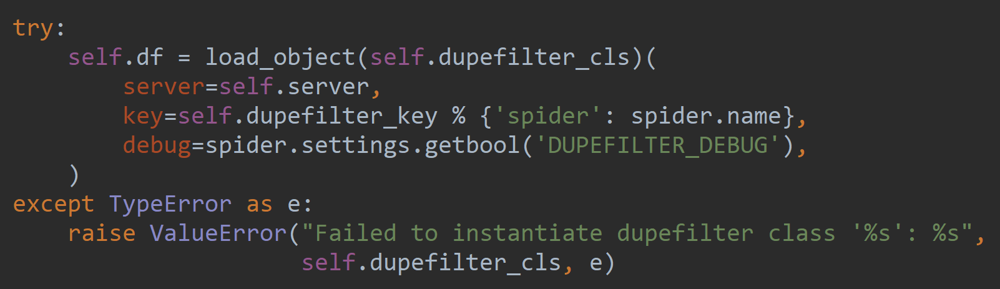
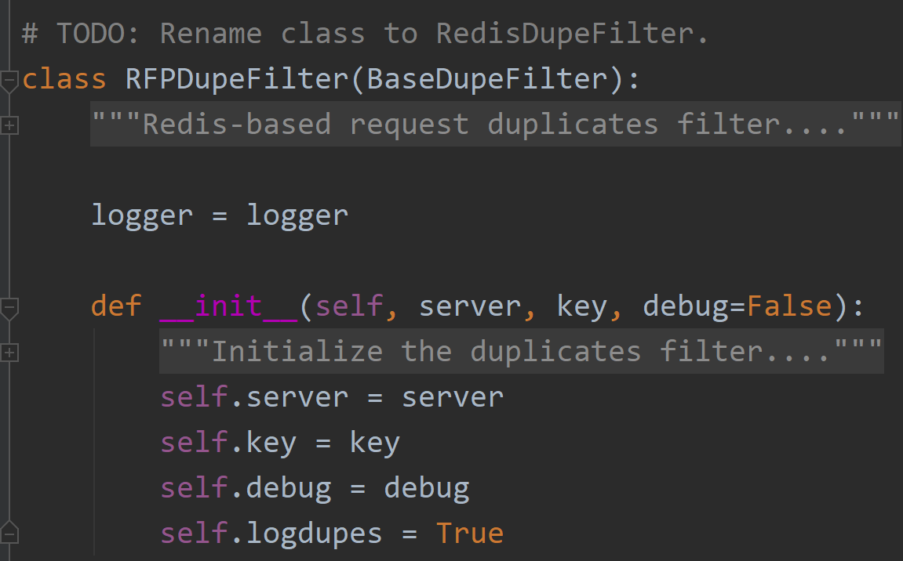
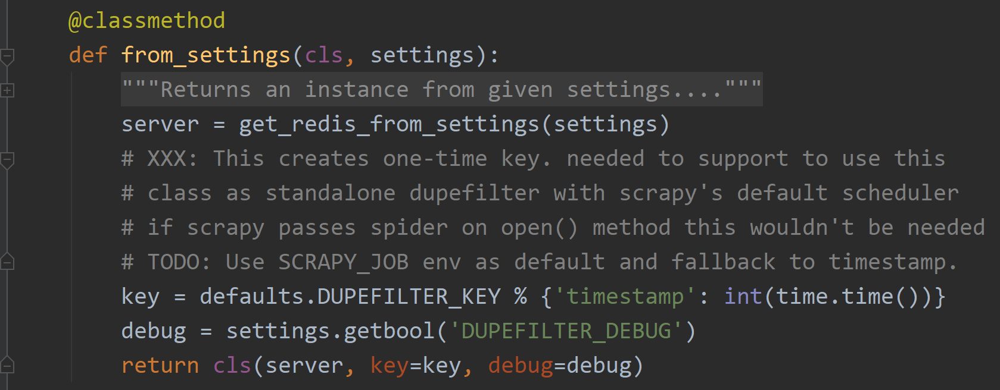
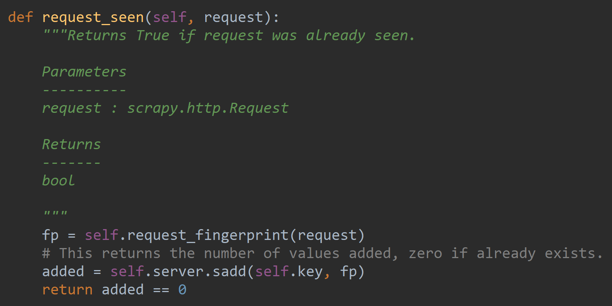
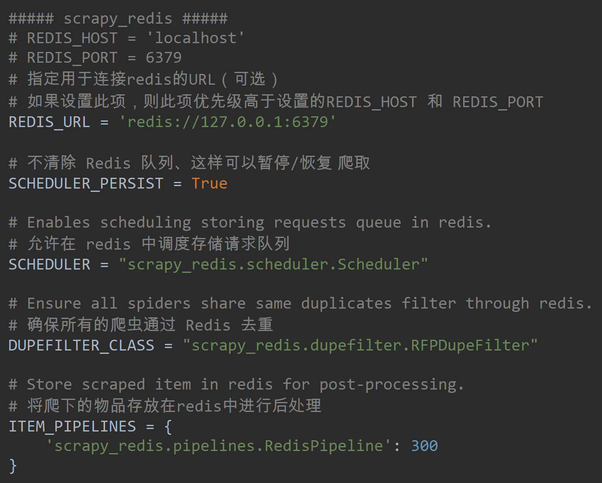

# Scrapy redis



- settings

```python
# Enables scheduling storing requests queue in redis.
SCHEDULER = "scrapy_redis.scheduler.Scheduler"

# Ensure all spiders share same duplicates filter through redis.
DUPEFILTER_CLASS = "scrapy_redis.dupefilter.RFPDupeFilter"

# Store scraped item in redis for post-processing.
ITEM_PIPELINES = {
    'scrapy_redis.pipelines.RedisPipeline': 300
}
```

- <strong>scrapy_redis/default.py</strong>



- <strong>scrapy_redis/scheduler.py</strong>



- <strong>scrapy_redis/dupefilter.py</strong>







- <strong>scrapy_redis/settings.py</strong>



- Terminal

1. run the spider:

   ```bash
   scrapy runspider 【spider.name】.py
   
   scrapy runspider gcbidding.py
   
   debug 也行
   ```

2. push urls to redis:

   ```bash
   redis-cli lpush 【spider.name】:start_urls http://google.com
   ```

```bash
redis-cli lpush gcbidding:start_urls https://www.gcbidding.com/portal/bidding
```


