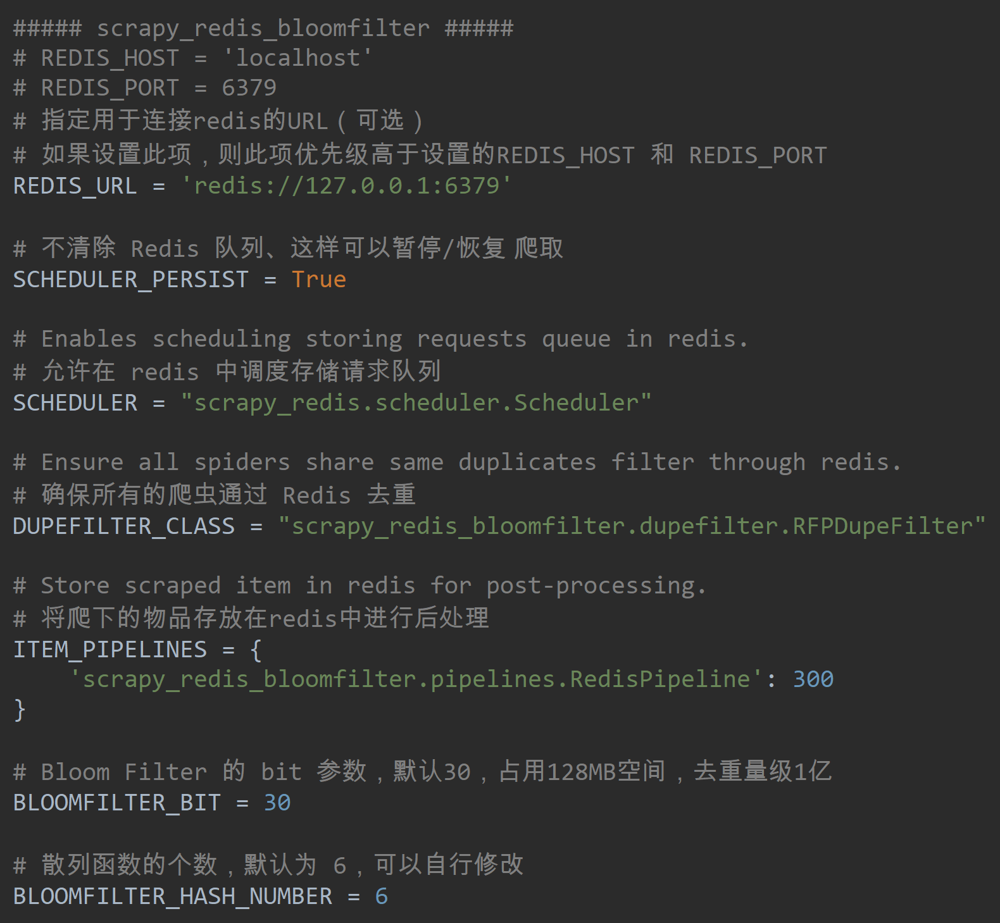

# Scrapy_redis_bloomfilter

`pip install scrapy_redis_bloomfilter `

- BloomFilter

BloomFilter 主要用于检索一个元素是否在集合中。优点是空间效率和查询效率比较高。缺点是存在误判率。


- <strong>scrapy_redis_bloomfilter/default.py</strong>


- <strong>scrapy_redis_bloomfilter/scheduler.py</strong>


- <strong>scrapy_redis_bloomfilter/dupefilter.py</strong>


- <strong>scrapy_redis_bloomfilter/settings.py</strong>



## 只去重 detail_url 不去重 list_url

- <strong>scrapy_redis_bloomfilter/scheduler.py</strong>
- <strong>spiders</strong>——custom_setting：是对setting中的文件内容进行覆盖。


> 由于 scheduler.close 没有传 Spider 所以取不到 list_url 的库名，但使用 custom_settings 对 SCHEDULER_DUPEFILTER_KEY 进行覆盖就可以获取到了。


- <strong>scrapy_redis_bloomfilter/dupefilter.py</strong>


## 慕课

```shell
# 需要 c++ buildtools 
pip install mmh3
```

<ul>
    <li><a href='py_bloomfilter.py
        '>py_bloomfilter</a></li>
</ul>

https://devblogs.microsoft.com/python/unable-to-find-vcvarsall-bat/

- <strong>dupefilter.py</strong>


- <strong>scheduler.py</strong>


- <strong>spider.py</strong>


- <strong>settings.py</strong>


