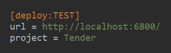
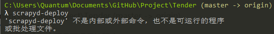
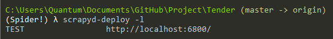
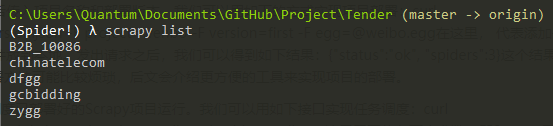
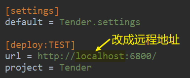
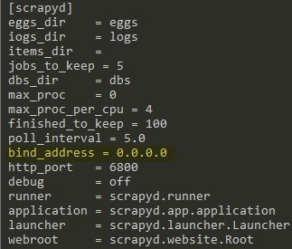

# Scrapyd

```shell
# 将 scrapy 部署到服务器中
pip install scrapyd

# 用于打包 scrapy 文件，再将项目导入 scrapyd/dbs
pip install scrapyd-client
```

1. 找到 scrapy.cfg 文件



2. `scrapyd-deploy`——win 下这个命令不能执行，新建个 .bat 文件解决




```
# 文件名 scrapyd-deploy.bat

@echo off
"C:\Users\Quantum\Documents\Environment\Spider!\Scripts\python.exe" "C:\Users\Quantum\Documents\Environment\Spider!\Scripts\scrapyd-deploy" %*
```



3. `scrapy list`



4. https://scrapyd.readthedocs.io/en/stable/api.html#

```shell
# daemonstatus.json——查看Scrapyd当前的服务和任务状态。
curl http://localhost:6800/daemonstatus.json

# addversion.json——部署Scrapy项目用的。
curl http://localhost:6800/addversion.json -F project=myproject -F version=r23 -F egg=@myproject.egg

# schedule.json——调度已部署好的Scrapy项目运行。
curl http://localhost:6800/schedule.json -d project=myproject -d spider=somespider

# cancel.json——取消某个爬取任务。
curl http://localhost:6800/cancel.json -d project=myproject -d job=6487ec79947edab326d6db28a2d86511e8247444

# listprojects.json——列出部署到Scrapyd服务上的所有项目描述。
curl http://localhost:6800/listprojects.json

# listversions.json——获取某个项目的所有版本号，版本号是按序排列的，最后一个条目是最新的版本号。
curl http://localhost:6800/listversions.json?project=myproject

# listspiders.json——获取某个项目最新版本的所有Spider名称。
curl http://localhost:6800/listspiders.json?project=myproject

# listjobs.json——获取某个项目当前运行的所有任务详情。
curl http://localhost:6800/listjobs.json?project=myproject

# delversion.json——删除项目的某个版本。
curl http://localhost:6800/delversion.json -d project=myproject -d version=r99

# delproject.json——删除某个项目
curl http://localhost:6800/delproject.json -d project=myproject
```

## 远程服务器部署

```shell
# 服务器
ssh root@106.13.160.14

qazwsx12345!
```

1. scrapy.cfg 改为远程服务器地址

```
106.13.160.14
```



2. `pip install scrapyd`

3. `find / -name default_scrapyd.conf`——查找配置文件所在路径，将修改。

4. `bind_address = 127.0.0.1 → bind_address = 0.0.0.0` ——不修改外网无法访问



5. `'/usr/local/python3/bin/scrapyd'`运行命令

6. `pip freeze > requirements.txt`——生成 requirements.txt

7. Dockerfile文件，文件不加任何后缀名

```dockerfile
# FROM代表使用的Docker基础镜像
FROM python:3.7.3

# ENV是环境变量设置，将/usr/local/bin:$PATH赋值给PATH，即增加/usr/local/bin这个环境变量路径。
ENV PATH /usr/local/bin:$PATH

# ADD是将本地的代码放置到虚拟容器中。它有两个参数：第一个参数是.，代表本地当前路径；第二个参数是/code，代表虚拟容器中的路径，也就是将本地项目所有内容放置到虚拟容器的/code目录下，以便于在虚拟容器中运行代码。
ADD . /code

# WORKDIR是指定工作目录，这里将刚才添加的代码路径设成工作路径。这个路径下的目录结构和当前本地目录结构是相同的，所以我们可以直接执行库安装命令、爬虫运行命令等。
WORKDIR /code

# RUN是执行某些命令来做一些环境准备工作。由于Docker虚拟容器内只有Python 3环境，而没有所需要的Python库，所以我们运行此命令来在虚拟容器中安装相应的Python库如Scrapy，这样就可以在虚拟容器中执行Scrapy命令了。
RUN pip3 install -r requirements.txt

# CMD是容器启动命令。在容器运行时，此命令会被执行。在这里我们直接用scrapy crawl quotes来启动爬虫。
CMD scrapy crawl quotes
```

8. `docker build -t gongwk:latest /home/quantum_ran/PycharmProjects/gongwk`——制作镜像

9. `docker login`——登录 dockerhub

10. `docker tag gongwk:latest quantum1024/gongwk:latest`——为新建的镜像打一个标签

12. `docker push quantum1024/gongwk:latest`——推送

11. `docker pull quantum1024/gongwk` ——先登录，下拉

