# 基础

last()

count()

name()

normalize-space()

start-with()

contains()

- 如果路径以双斜线 // 开头, 则表示选择文档中所有满足双斜线//之后规则的元素(无论层级关系)

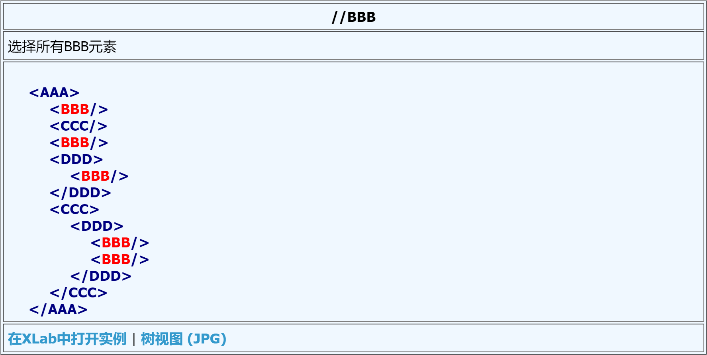

- 星号 * 表示选择所有由星号之前的路径所定位的元素

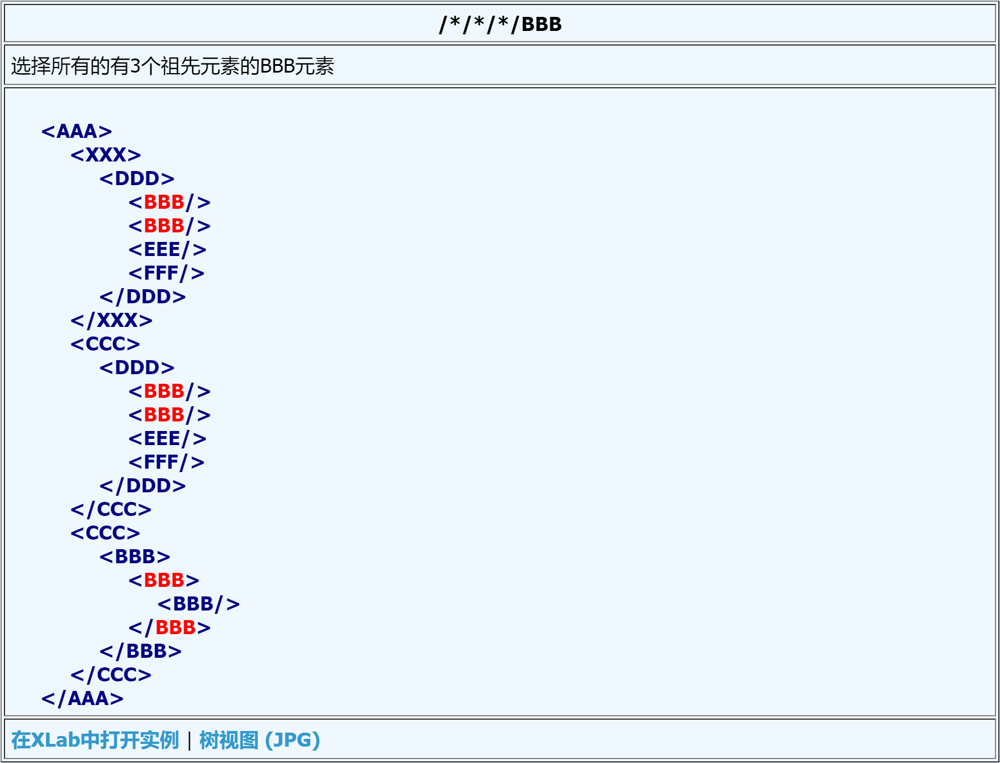

- 方块号里的表达式可以进一步的指定元素, 其中数字表示元素在选择集里的位置, 而last()函数则表示选择集中的最后一个元素.

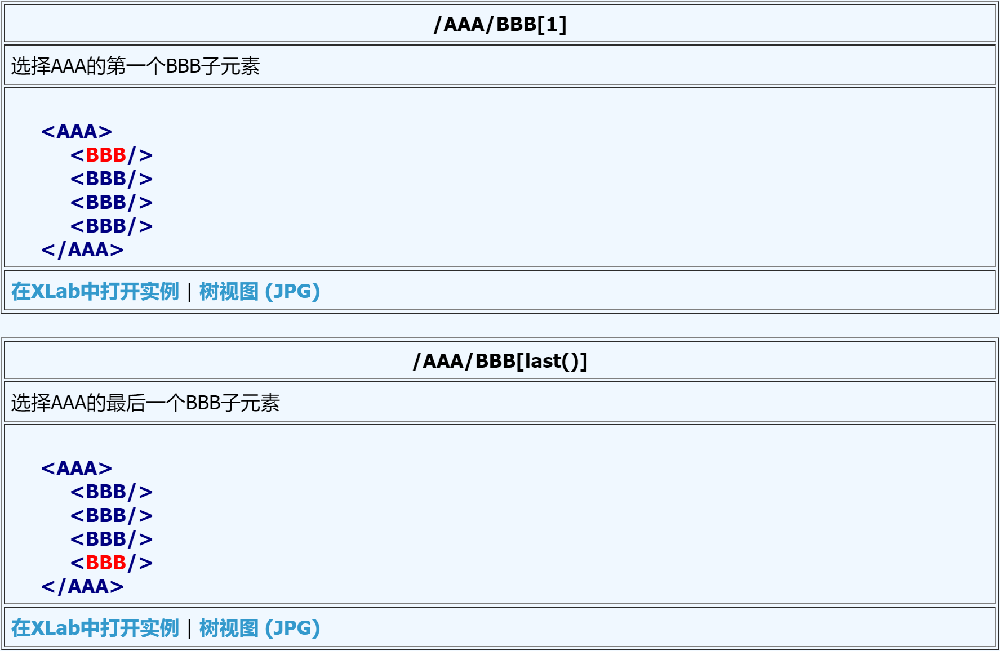

- 属性的值可以被用来作为选择的准则, normalize-space函数删除了前部和尾部的空格, 并且把连续的空格串替换为一个单一的空格

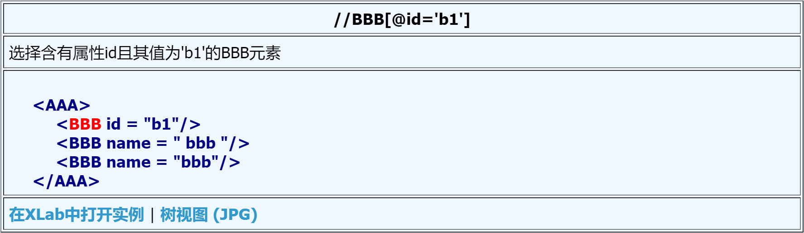

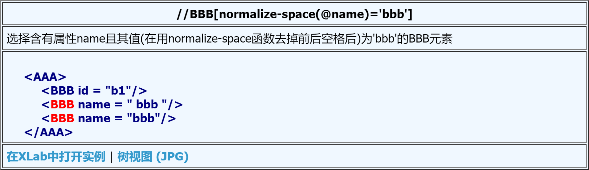

- count()函数可以计数所选元素的个数

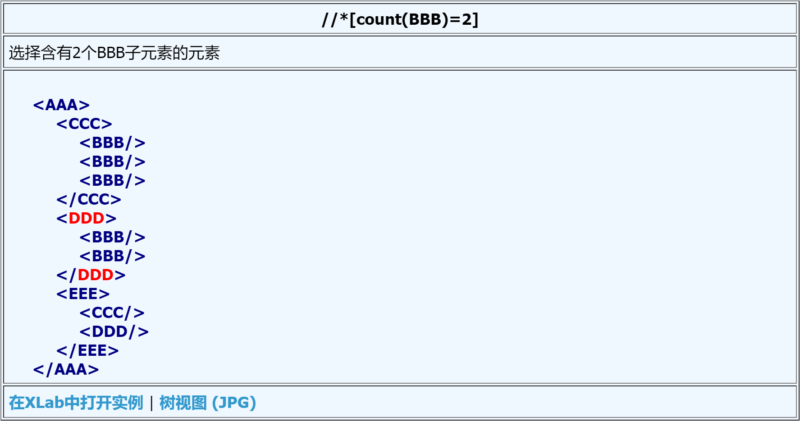

- name()函数返回元素的名称, start-with()函数在该函数的第一个参数字符串是以第二个参数字符开始的情况返回true, contains()函数当其第一个字符串参数包含有第二个字符串参数时返回true.

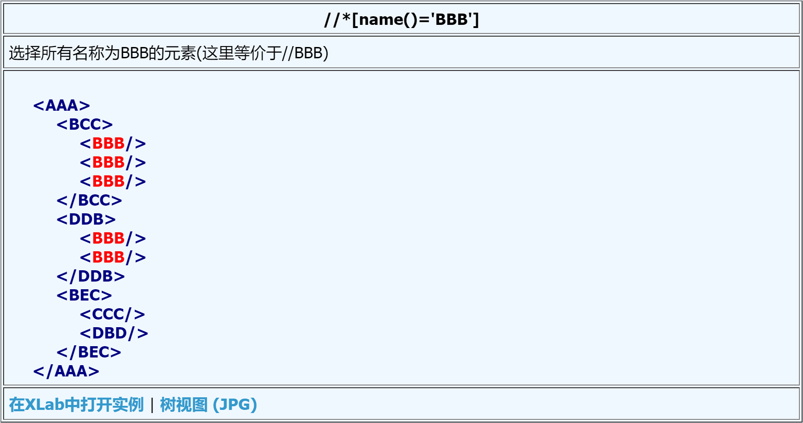

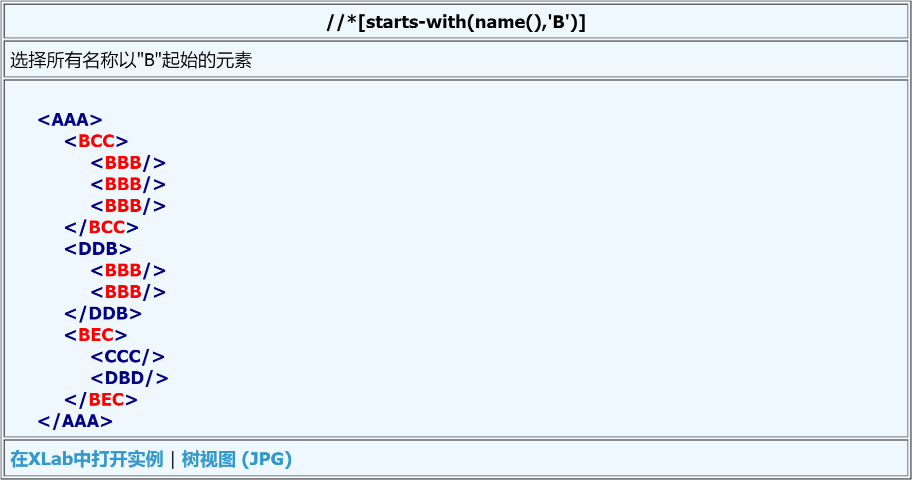

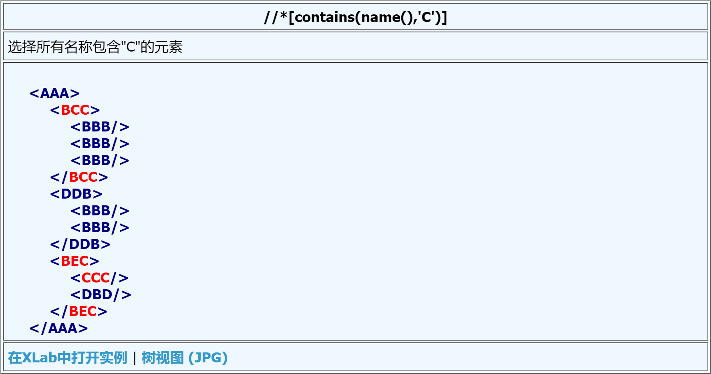

- 多个路径可以用分隔符 | 合并在一起

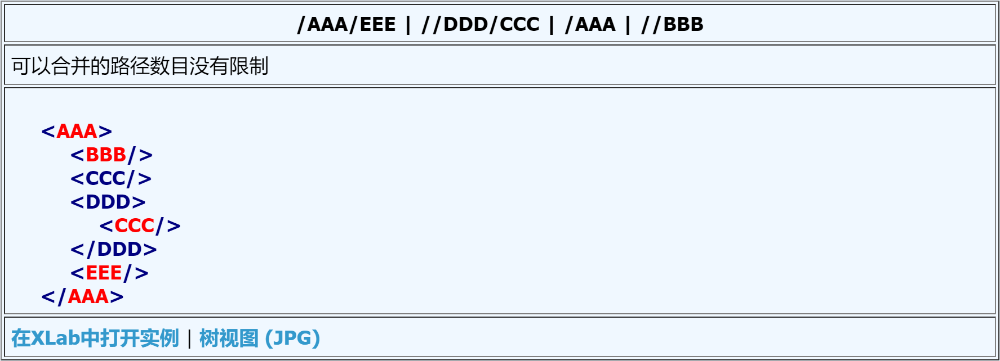

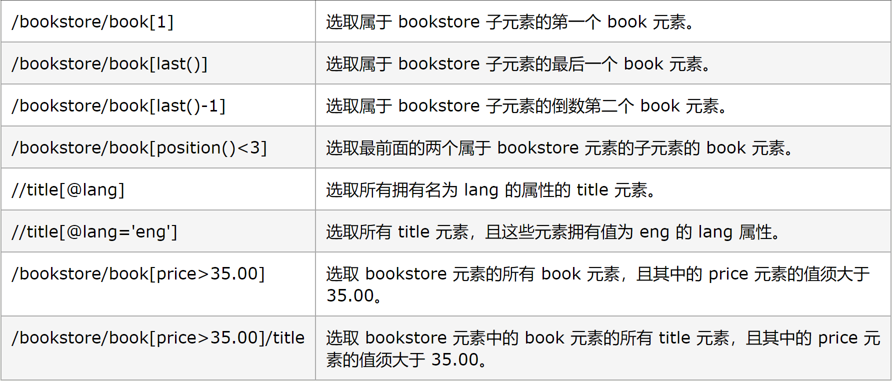

