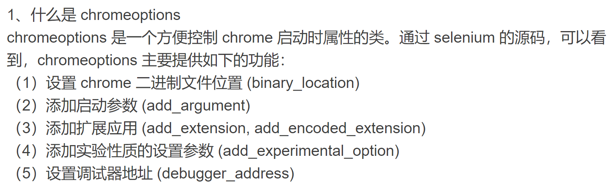
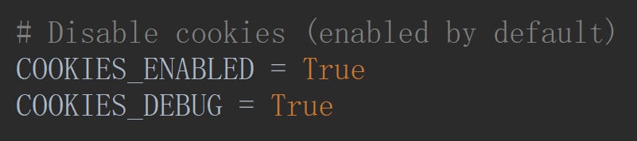
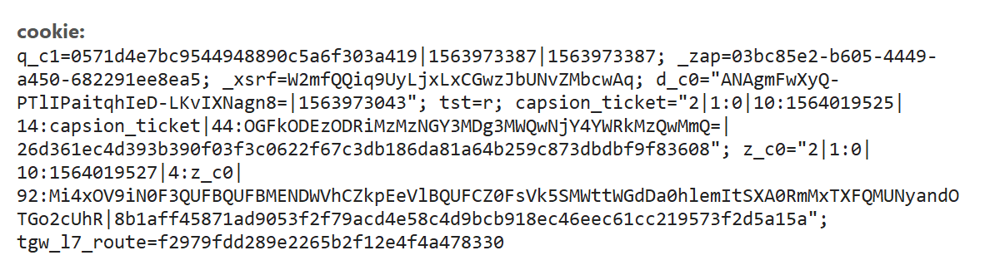

# 知乎模拟登录

1. 把 Chrome 关闭

2. 启动 Chrome

```shell
C:\Program Files (x86)\Google\Chrome\Application
λ chrome.exe --remote-debugging-port=9222

# 检测是否成功
open 127.0.0.1:9222/json
```

3. 使用 Selenium 模拟登录

```shell
# 定制启动
chromeOptions = Options()

# 添加实验性质的设置参数
chromeOptions.add_argument('--disable-extensions')

# 设置调试器地址
chromeOptions.add_experimental_option('debuggerAddress', '127.0.0.1:9222')

# 启动
driver = webdriver.Chrome(
executable_path="C:/Users/Quantum/Documents/Environment/Python37/chromedriver.exe",
chrome_options=chromeOptions,
)
```



3. 获取Cookies

- <strong>settings</strong>



```python
[{'domain': 'zhihu.com', 
  'expiry': 1627045042.889473, 
  'httpOnly': False, 
  'name': '_zap', 
  'path': '/', 
  'secure': False, 
  'value': '03bc85e2-b605-4449-a450-682291ee8ea5'
 }, 
 {'domain': 'zhihu.com', 
  'expiry': 1641733042.889568, 
  'httpOnly': False, 
  'name': '_xsrf', 
  'path': '/', 
  'secure': False, 
  'value': 'W2mfQQiq9UyLjxLxCGwzJbUNvZMbcwAq'
 }, 
 {'domain': 'zhihu.com', 
  'expiry': 1566611526.214818, 
  'httpOnly': True, 
  'name': 'capsion_ticket', 
  'path': '/', 
  'secure': False, 
  'value': '"2|1:0|10:1564019525|14:capsion_ticket|44:OGFkODEzODRiMzMzNGY3MDg3MWQwNjY4YWRkMzQwMmQ=|26d361ec4d393b390f03f3c0622f67c3db186da81a64b259c873dbdbf9f83608"'
 }, 
 {'domain': 'zhihu.com', 
  'expiry': 1566609497, 
  'httpOnly': False, 
  'name': 'tst', 
  'path': '/', 
  'secure': False, 
  'value': 'r'
 }, 
 {'domain': 'www.zhihu.com', 
  'expiry': 1564020427.055259, 
  'httpOnly': False, 
  'name': 'tgw_l7_route', 
  'path': '/', 
  'secure': False, 
  'value': '66cb16bc7f45da64562a077714739c11'
 }, 
 {'domain': 'zhihu.com', 
  'expiry': 1658581044.131084, 
  'httpOnly': False, 
  'name': 'd_c0', 
  'path': '/', 
  'secure': False, 
  'value': '"ANAgmFwXyQ-PTlIPaitqhIeD-LKvIXNagn8=|1563973043"'
 }]
```



对比来看，就是`name=value`

4. 知乎倒立文字

https://github.com/muchrooms/zheye

```shell
pip install -i https://pypi.douban.com/simple Keras

pip install -i https://pypi.douban.com/simple Pillow

pip install -i https://pypi.douban.com/simple jupyter

pip install -i https://pypi.douban.com/simple matplotlib

pip install -i https://pypi.douban.com/simple numpy

pip install -i https://pypi.douban.com/simple scikit-learn

pip install -i https://pypi.douban.com/simple tensorflow

pip install -i https://pypi.douban.com/simple h5py
```

